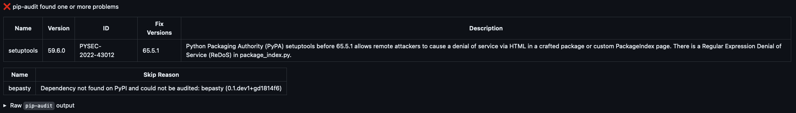
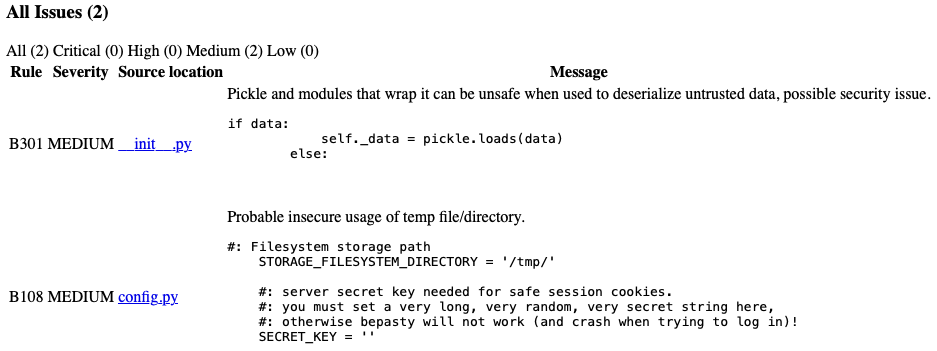

_Door Niels Van De Ginste en Tom Goedemé_

## Inleiding

In dit verslag wordt een gedetailleerde beschrijving gegeven over het eerste project voor het vak Cyber Security Advanced. Voor dit project hebben we een secure pipeline project opgesteld dat verscheidene veiligheidsscans uitvoert op de code van een open source project. Uiteraard gaan wij ook de nodige best practices uitvoeren om onze eigen pipeline zo veilig mogelijk te gebruiken.

Het project waar wij voor hebben gekozen heet [Bepasty](https://github.com/bepasty/bepasty-server). Dit is een pastebin geschreven in Python. Op deze code gaan dus verschillende checks uitgevoerd wo

## Threat model

### Beschrijving

Hierboven zit u het threat model van onze pipeline. De pipeline bevat de verschillende stappen beginnend bij de developer die code pusht naar de repositoery tot aan het continue draaien van ons programma. Bij de verschillende fasen en hun overgangen kunnen eventueel één of meerdere zwakheden dreiging aanwezig zijn. Deze staan hieronder beschrijven, maar eerst wordt elke fase kort toegelicht:

- Source: De source repository met de code van het open source project en onze pipeline.yml.
- Build:  De fase waar de code wordt gebouwd tot een werkend product. In ons project is dit wanneer de package gevormed word.
- Test: Het werkend product wordt getest op eventuele zwakheden of onverwacht gedrag.
- Release: Een definitieve versie wordt gepusht naar de officiële python repository pypi.
- Operate: Het product blijft voor langere tijd actief. Al dan niet gebruikt door een klant of een developer.

### Toelichting zwakheden

Nu elk onderdeel is besproken, worden de verschillende zwakheden ook even kort toegelicht, opgesplitst volgens de fase waarin deze kunnen voorkomen. De zwakheden die in het **vetgedrukt** staan, proberen wij op een bepaalde manier op te lossen. Dit kan zijn met behulp van veiligheidsscans in onze pipeline of algemene best practices.

#### Developer ==> Source

- **T01**: Tijdens een push zou de mogelijkheid bestaan dat een aanvaller de code van de developer onderschept en wijzigt, waardoor er (malafide) aangepaste code staat in de source repo.
- **T02**: De developer kan per ongeluk zelf zwakheden introduceren, doordat slechte code wordt toegevoegd aan de repo.
- T03: Aangezien we een remote repository gebruiken van een extern bedrijf Github moeten we deze partner vertrouwen. Maar deze heeft in principe volle toegang tot de code en zou deze ook kunnen aanpassen.

#### Source

- **T04**: De kans bestaat dan een gebruiker toegang krijgt tot de repository met de code. Dit kan bijvoorbeeld gebeuren door nalatig gebruik van credentials.

#### Source ==> Build

- T05: Een aanvaller zou juist voorde built van de code de buildsource veranderen. Op deze manier worden anders bestanden gebruikt tijdens de bouw, wat kan leiden tot zwakheden.
- T06: Wanneer de code eerder werd veranderd in de source repo, betekent dit dat er zwakheden kunnen optreden wanneer de aangepaste code wordt uitgevoerd.
- T07: Github maakt gebruik van caching om performanter te zijn tijdens herhaaldeijke builds. Deze cache zou poisoned kunnen geraken, wat enige build zou compromitteren.

#### Build

- T08: Een aanvaller kan ongeautoriseerde builds uitvoeren mocht hij toegang gekregen hebben tot de build.
- **T09**: Wanneer er tijdens de build libraries worden gebruikt met zwakheden in, dan is het gebouwde product zelf ook kwetsbaar.

#### Test

- **T10**: Testen van code is een belangrijke taak die grondig uitgevoerd moet worden. Wanneer er niet me aandacht wordt getest, kunnen fouten onder de rader blijven en verder in de release fase geraken.
- **T11**: Vaak worden ook geautomatiseerde tests uitgevoerd zoals in een pipeline. Echter kan men vergeten om een blockade te starten wanneer fouten worden gevonden. Indien dit niet wordt gedaan, geraken bugs of sensitieve data alsnog in productieomgevingen ook al zijn deze wel gedetecteerd geweest.

#### Test ==> Release

- T12: Het risico bestaat dat tijdens de upload van een bepaalde package naar pypi, deze package wordt opgevangen en aangepast.

#### Release

- **T13**: Wanneer tijdens de development nalatig is omgegaan met credentials in de source code, worden deze credentials publiek beschikbaar gemaakt door de release.
- T14: Wanneer een aanvaller toegang heeft tot de repository van het project, kunnen er ongeautoriseerde releases uitgebracht worden met malafide code.

#### Release ==> Operate

- T15: Wanneer de release repository (pypi) wordt gecompromised, kunnen hier  malafide versies van pakketten in terecht komen.

#### Operate

- T16: Wanneer onze tool draait voor een langere tijd, kunnen de libraries die worden gebruikt out of date geraken. Daarnaast kunnen zwakheden ontdekt worden die tijdens de release nog niet gekend waren.

## Security Scans

### SBOM-generatie

Met deze actie wordt bij elke commit een Software Bill of Materials (SBOM) gegenereerd. Een SBOM is een document waarin alle afhankelijkheden van een softwareproject worden vermeld, inclusief de versies van de gebruikte bibliotheken en andere componenten. Dit biedt een gedetailleerd overzicht van de gebruikte softwarecomponenten en hun versies in het project.

### Depedency checking met pip-audit

Deze actie biedt de mogelijkheid om grondig te controleren of er bekende kwetsbaarheden aanwezig zijn in de afhankelijkheden van de code die wordt gebruikt. Door pip-audit te gebruiken, kunnen we de afhankelijkheden van het project analyseren en controleren of er beveiligingsproblemen of bekende zwakke punten zijn in de gebruikte pakketten. Het resultaat van deze scan wordt vastgelegd en als een artifact geüpload, zodat het team toegang heeft tot een gedetailleerd rapport over eventuele kwetsbaarheden.

### SAST-scan met AppThreat
Deze actie zal de code scannen op kwetsbaarheden met behulp van AppThreat. Na het scannen zal er een artifact beschikbaar worden gesteld met een rapport over de gevonden kwetsbaarheden.

### DAST-scan met ZAP
Deze actie is bedoeld voor het uitvoeren van een Dynamic Application Security Testing (DAST)-scan met behulp van de Zed Attack Proxy (ZAP). Tijdens deze scan zal ZAP de webapplicatie actief testen op mogelijke beveiligingskwetsbaarheden en potentiële risico's identificeren. 

### Credentials-scan met TruffleHog
Deze actie zal een scan uitvoeren voor het vinden van credenties met behulp van TruffleHog. TruffleHog is een tool voor statische analyse die door de broncode zoekt op zoek naar mogelijke lekken van gevoelige informatie, zoals wachtwoorden, API-sleutels en andere vertrouwelijke gegevens. 

## Best practices voor een secure pipeline

### Commits signing

We maken gebruik van commit signing om de integriteit van onze code te waarborgen. Dit betekent dat elke wijziging die we aanbrengen in onze codebase digitaal wordt ondertekend met een unieke handtekening. Hierdoor kunnen we verifiëren dat de wijzigingen daadwerkelijk afkomstig zijn van een geautoriseerde bron en niet zijn gewijzigd of gemanipuleerd onderweg.

Daarnaast hebben we ingesteld dat branches niet kunnen worden gemerged als ze commits bevatten die niet zijn ondertekend. Commit signing is dus niet alleen een integriteitscontrole, maar ook een essentieel onderdeel van ons merge- en goedkeuringsproces.

### Pull request boven push

Onze pipeline wordt uitgevoerd op basis van pull requests in plaats van directe pushes naar de repository. Deze aanpak is bedoeld om potentiële zwakke punten te identificeren en te voorkomen dat ze rechtstreeks in onze codebase terechtkomen. 

Door gebruik te maken van pull requests geven we ons ontwikkelteam de mogelijkheid om hun wijzigingen te valideren en te bespreken voordat ze worden samengevoegd. 

