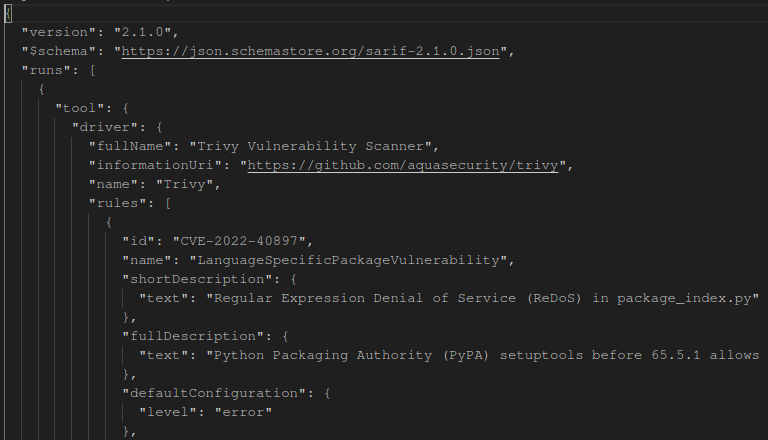

_Door Niels Van De Ginste en Tom Goedemé_

## Inleiding

In dit verslag wordt een gedetailleerde beschrijving gegeven over het eerste project voor het vak Cyber Security Advanced. Voor dit project hebben we een secure pipeline opgesteld dat verscheidene veiligheidsscans uitvoert op de code van een open source project. Uiteraard gaan wij ook de nodige best practices uitvoeren om zo veilig mogelijk te werken binnen in onze repository.

Het project waar wij voor hebben gekozen heet [Bepasty](https://github.com/bepasty/bepasty-server). Dit is een pastebin geschreven in Python. Op deze code gaan dus verschillende checks uitgevoerd worden.

Link naar de repository: https://github.com/flufsor/CSA-Opdracht1

De pipeline bestanden kan u terugvinden in de volgende folder: `.github/workflows`
## Threat model

### Beschrijving

Hierboven zit u het threat model van onze pipeline. De pipeline bevat de verschillende stappen beginnend vanaf de developer die code pusht naar de repository tot aan het continue draaien van een Bepasty-server. Bij de verschillende fasen en hun overgangen kunnen eventueel één of meerdere dreigingen aanwezig zijn. Deze staan hieronder beschreven, maar eerst wordt elke fase kort toegelicht:

- Source: de source repository met de code van het open source project en het yaml bestand van onze pipeline.
- Build:  de fase waar de code wordt gebouwd tot een werkend product. In ons project is dit wanneer de package gevormd word.
- Test: het werkend product wordt getest op eventuele zwakheden en eventueel onverwacht gedrag.
- Release: een definitieve versie wordt gepusht naar de officiële python repository PyPi.
- Operate: de Bepasty-server blijft voor langere tijd actief. Al dan niet gebruikt door een klant of een developer.

### Toelichting zwakheden

Nu elk onderdeel is besproken, worden de verschillende zwakheden ook even kort toegelicht. De verschillende zwakheden zijn gegroepeerd volgens de fase waarin deze kunnen voorkomen. De zwakheden die in het **vetgedrukt** staan proberen wij op een bepaalde manier op te lossen. Dit kan zijn met behulp van veiligheidsscans in onze pipeline of via algemene best practices.

#### Developer ==> Source

- **T01**: Tijdens een push kan het voorkomen dat een aanvaller de code van de developer onderschept en wijzigt, waardoor er (malafide) aangepaste code in de source repo terecht komt.
- **T02**: De developer kan per ongeluk zelf zwakheden introduceren, doordat slechte code wordt toegevoegd aan de repo.
- T03: Aangezien wij van een remote repository gebruiken bij het extern bedrijf Github, vertrouwen wij hen onze code toe. Dit is een security risk waar rekening mee gehouden moet worden.

#### Source

- **T04**: De kans bestaat dan een gebruiker toegang krijgt tot de repository met de code. Dit kan bijvoorbeeld gebeuren door nalatig gebruik van credentials.

#### Source ==> Build

- T05: Een aanvaller zou juist voor de built de buildsource kunnen veranderen. Op deze manier worden anders bestanden gebruikt tijdens de bouw, wat kan leiden tot zwakheden.
- T06: Wanneer de code eerder werd veranderd in de source repo, betekent dit dat er zwakheden kunnen optreden wanneer de aangepaste code wordt uitgevoerd.
- T07: Github maakt gebruik van caching om efficiënter te zijn tijdens herhaaldelijke builds. Een hacker zou deze cache kunnen "vergiftigen", wat de build kan compromitteren.

#### Build

- T08: Een aanvaller kan ongeautoriseerde builds uitvoeren, wanneer hij toegang heeft tot het bouwproces.
- **T09**: Wanneer er tijdens de build libraries worden gebruikt met zwakheden in, dan is het gebouwde product zelf ook kwetsbaar.

#### Test

- **T10**: Testen van code is een belangrijke taak die grondig uitgevoerd moet worden. Wanneer er niet met aandacht wordt getest, kunnen fouten onder de rader blijven en verder in de release fase geraken.
- **T11**: Vaak worden ook geautomatiseerde tests uitgevoerd, al dan niet via een pipeline. Echter kan men vergeten om een blockade te starten wanneer fouten worden gevonden. Indien dit niet wordt gedaan, geraken bugs of sensitieve data alsnog in productieomgevingen.

#### Test ==> Release

- T12: Een pakket kan tijdens de upload naar PyPi opgevangen en aangepast worden. Hierdoor wordt een malafide versie van het pakket publiek beschikbaar gesteld.

#### Release

- **T13**: Wanneer tijdens de development nalatig is omgegaan met credentials in de source code, worden deze credentials publiek beschikbaar gemaakt door de release.
- T14: Wanneer een aanvaller toegang heeft tot de repository van het project, kunnen er ongeautoriseerde releases uitgebracht worden met malafide code.

#### Release ==> Operate

- T15: Wanneer de release repository (pypi) wordt gecompromised, kunnen hier  malafide versies van pakketten in terecht komen.

#### Operate

- T16: Wanneer onze tool draait voor een langere tijd, kunnen de libraries die worden gebruikt out of date geraken. Daarnaast kunnen zwakheden ontdekt worden die tijdens de release nog niet gekend waren.

## Security Scans

Hieronder worden verschillende soorten security scans toegelicht die tijdens de pipeline worden uitgevoerd. We maken gebruik van verscheiden derde partij tools, om aan te tonen dat er veel mogelijkheden zijn om een veilig scanproces op te stellen.

We hebben geprobeerd om de resultaten van de scans in een "sarif" formaat te plaatsen. Aangezien dit de standaard output is van artifacts in een Github action pipeline.

### SBOM-generatie

Met deze actie wordt bij elke commit een Software Bill of Materials (SBOM) gegenereerd. Een SBOM is een document waarin alle afhankelijkheden van een softwareproject worden vermeld, inclusief de versies van de gebruikte bibliotheken en andere componenten. Dit biedt een gedetailleerd overzicht van de gebruikte softwarecomponenten en hun versies in het project.

Het wordt gebruikt voor beveiliging en kwetsbaarheidsbeheer, compliance en licentiebeheer, transparantie en vertrouwen van stakeholders, effectief onderhoud en support, evenals risicobeoordeling in softwareontwikkeling en -gebruik.

Hieronder ziet u een deel van de gegenereerde SBOM:

### Depedency checking met pip-audit

Deze actie biedt de mogelijkheid om grondig te controleren of er bekende kwetsbaarheden aanwezig zijn in de afhankelijkheden van de code die wordt gebruikt. Door pip-audit te gebruiken, kunnen we de afhankelijkheden van het project analyseren en controleren of er beveiligingsproblemen of bekende zwakke punten zijn in de gebruikte pakketten. Het resultaat van deze scan wordt vastgelegd en vervolgens als een artifact geüpload. Op deze manier heeft het team toegang tot een gedetailleerd rapport over eventuele kwetsbaarheden.

### SAST-scan met AppThreat

Deze actie zal de code in de repository scannen op kwetsbaarheden met behulp van de SAST-tool AppThreat. Na het scannen zal er opnieuw een artifact beschikbaar worden gesteld met een rapport over de gevonden kwetsbaarheden.

### DAST-scan met ZAP

Voor de Dynamic Application Security Testing-scan maken we gebruik van de Zed Attack Proxy (ZAP). Tijdens deze scan zal ZAP de webapplicatie actief testen op mogelijke kwetsbaarheden en potentiële risico's identificeren. We spreken dan vooral over mogelijke XSS-zwakheden, ontbrekende security headers (CSRF, Anti-clickjacking, outdated libraries, ...).

Bijkomend is er in de pipeline een context bestand meegegeven aan deze scan. Hierdoor kan ZAP gebruikmaken van een authenticatiemethode om zo tot webpagina's te geraken die normaal gezien enkel na een inlogactie toegankelijk zijn.

Zoals u op de onderstaande foto ziet, wordt een HTML rapport gegenereerd. Dit rapport bevat een oplijsting van alle gevonden zwakheden tijdens de DAST-scan. Dit rapport wordt opnieuw als een artifact geüpload naar Github.

> Tijdens het testen van de code met Zap (DAST) maken we gebruik van de development server van WSGI in plaats van de volledige Nginx- en Gunicorn-productiestack. Dit zou geen invloed moeten hebben op de resultaten, maar we vonden het toch belangrijk om dit te vermelden.

### Credentials-scan met TruffleHog

Trufflehog zal een scan uitvoeren dat zich focust op het vinden van gevoelige informatie zoals wachtwoorden, API-sleutels, SSH-keys Deze tool voert een statische analyse uit en zal alle code overlopen.

### Container scan met Trivy

Indien de gebruiker de Bepasty-server wilt laten draaien in een container. Kan hij de Dockerfile gebruiken die in de repository aanwezig is. Dit betekent echter dat er een nieuwe kwetsbaarheid wordt geïntroduceerd: Docker images.

We hebben Trivy toegevoegd aan ons pipeline proces om eventuele zwakheden in de container te ontdekken. Tijdens de pipeline wordt de container opgestart en gaat Trivy verschillende checks uitvoeren, zo wordt onder andere de image van de container nagekeken op zwakheden.

Hieronder vindt u een deel van de het resultaat dat Trivy heeft gegenereerd.

## Best practices voor een secure pipeline

### Credential management

We gebruiken GitHub zelf als credential manager. We hebben voor GitHub gekozen vanwege de naadloze integratie met GitHub Actions. Aangezien onze pipeline al op GitHub-servers draait, is er ook geen extra partij die toegang heeft tot de credentials.

### Commits signing

We maken gebruik van commit signing om de integriteit van onze code te waarborgen. Dit betekent dat elke wijziging die we aanbrengen in onze codebase digitaal wordt ondertekend met een unieke handtekening. Hierdoor kunnen we verifiëren dat de wijzigingen daadwerkelijk afkomstig zijn van een geautoriseerde bron en niet zijn gewijzigd of gemanipuleerd onderweg.

Daarnaast hebben we ingesteld dat branches niet kunnen worden gemerged als ze commits bevatten die niet zijn ondertekend. Commit signing is dus niet alleen een integriteitscontrole, maar ook een essentieel onderdeel van ons merge- en goedkeuringsproces.

Wij zijn ervan bewust dat het verplicht signen van commits het moeilijker maakt om contributors hun code toe te voegen aan de repo. Deze methode komt dus meer tot zijn recht bij gesloten projecten.
### Pull request boven push

Onze pipeline wordt uitgevoerd op basis van pull requests in plaats van directe pushes naar de repository. Deze aanpak is bedoeld om potentiële zwakke punten te identificeren en te voorkomen dat ze rechtstreeks in onze codebase terechtkomen. 

Door gebruik te maken van pull requests geven we ons ontwikkelteam de mogelijkheid om hun wijzigingen te valideren en te bespreken voordat ze worden samengevoegd. 

In onze repository geldt ook de volgende ruleset: wanneer een scan faalt, wat wijst op een zwakheid, zal de pull request niet gemerged kunnen worden met de main branch. Dit voorkomt nalatig gebruik van de veiligheidsscans die worden uitgevoerd. De SBOM mag echter wel falen, aangezien deze enkel een schets genereert van onze codebase.

### Verschillende pipeline voor master en dev

De master en development branch in onze repositories hebben verschillende doelen. De dev branch bevat alle recente wijzigingen, terwijl de master branch zo stabiel mogelijk moet blijven.

Daarom voorzien wij ook twee verschillende pipeline bestanden die licht van elkaar verschillen. U kan hieronder een korte opsomming hiervan terugvinden:

- De **dev pipeline** bevat geen SBOM analyse, aangezien deze enkel van toepassing is op de releases
- De **master pipeline** kan periodiek uitgevoerd worden (zie volgende paragraaf), aangezien het belangrijk is om nieuwe kwetsbaarheden te vinden, ook al is er geen nieuwe release voor een langere tijd.
### Periodieke scans

Tijdens de development van een applicatie, zijn er periodes waarbij weinig tot geen pul requests plaatsvinden. De kans bestaat echter dat gedurende deze periode zwakheden gevonden worden in de code en/of libraries.

We kunnen hiervoor elke week onze security scans uitvoeren volgens een vast schema. Op deze manier worden nieuwe zwakheden ontdekt, ook al wordt er geen code toegevoegd aan de repository.

Deze functionaliteit is echter niet actief in onze pipeline, aangezien niet alle scans een issue aanmaken op de repository. Dit maakt het moeilijk om verwittigt te worden indien er problemen tijdens deze periodieke scans optreden.

## Conclusie

In dit verslag hebben we een gedetailleerde beschrijving gegeven van ons project voor het vak Cyber Security Advanced. We hebben een secure pipeline ontwikkeld om verschillende veiligheidsscans uit te voeren op de code van het open source project "Bepasty". Onze pipeline is ontworpen om potentiële zwakke punten in de code te identificeren en te voorkomen dat deze in de main repository terechtkomen. We hebben ook best practices geïmplementeerd om de integriteit van onze code en de veiligheid van het ontwikkelproces te waarborgen.

## Geleerde lessen

Deze opdracht heeft ons veel doen bijleren over de best practices in een secure pipeline: zo draagt het uitvoeren van security scans bij aan een veilige en betrouwbare flow in de repository. Ook het signen van commits helpt om de integriteit van de toegevoegde code te bewaren. 

Tot slot hebben we ondervonden dat de security scans best uitgevoerd worden bij pull requests. Op deze manier kunnen de scans dienen als automatische controle om te bepalen of code al dan niet gemerged mag worden. Dit voorkomt dat onveilige code in de codebase terechtkomt.